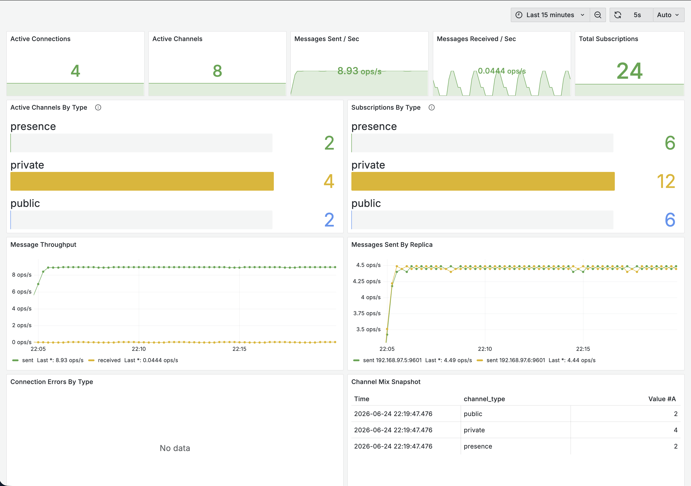
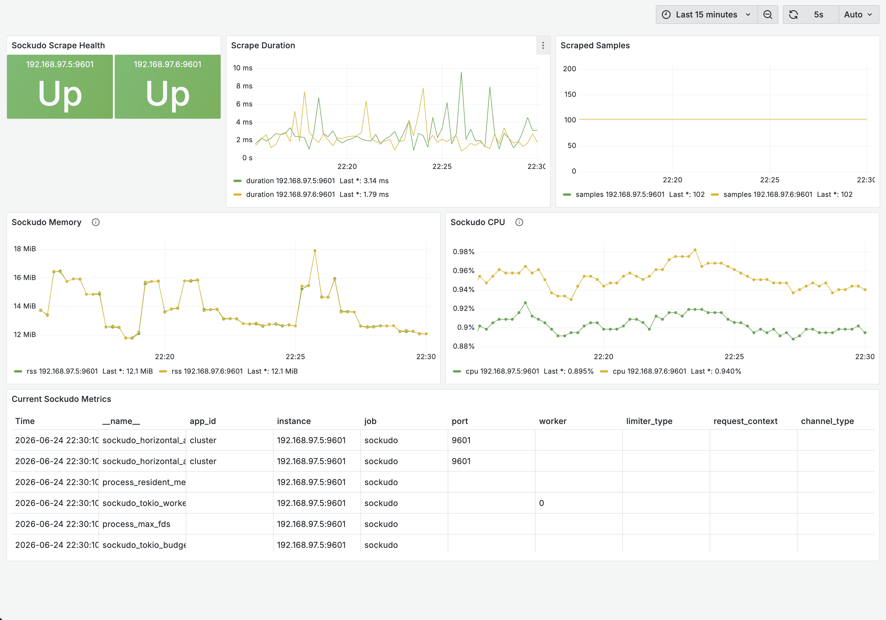

# Sockudo Docker Prototype

## Prerequisites

- Docker installed and running
- Git installed
- Node.js and pnpm installed
- `just` installed for the commands in this repo's `Justfile`
- Access to clone the Sockudo repository

## Build Dashboard Images

The dashboard images should be built from the same Sockudo version used by this Docker Compose stack.

Clone Sockudo from the directory where you want to keep the project:

```sh
git clone https://github.com/sockudo/sockudo.git
cd sockudo
```

If the repository is already cloned:

```sh
cd path/to/sockudo
```

Check out the required version:

```sh
git fetch --tags
git checkout v4.6.0
git describe --tags --always
```

Build the dashboard API image:

```sh
docker build \
  -f dashboard/Dockerfile \
  --target api \
  -t sockudo-dashboard-api:4.6.0 \
  ./dashboard
```

Build the dashboard web image:

```sh
docker build \
  -f dashboard/Dockerfile \
  --target web \
  -t sockudo-dashboard-web:4.6.0 \
  ./dashboard
```

Verify both images exist:

```sh
docker image inspect sockudo-dashboard-api:4.6.0
docker image inspect sockudo-dashboard-web:4.6.0
```

Or:

```sh
docker images | grep sockudo-dashboard
```

## Prepare Environment

Create the local `.env` files from the checked-in examples and install the helper script dependencies:

```sh
just setup-env
```

Existing `.env` files are skipped. Review the values under `config/` before starting the stack.

## Run The Stack With Multiple Sockudo Nodes

Start the stack with the default two Sockudo replicas:

```sh
just scale
```

To run more Sockudo replicas, pass the replica count:

```sh
just scale 3
```

## Run Demo Scripts

Run the publisher and consumer in separate terminals:

```sh
cd scripts
pnpm publish
```

```sh
cd scripts
pnpm consume
```

Optional publisher settings:

```sh
pnpm publish -- --stock-interval-ms 500 --notification-interval-ms 2000
```

Optional consumer settings:

```sh
pnpm consume -- --user-id alice --user-name "Alice"
```

Defaults: the consumer uses `demo-user-1` and `Demo User`; the publisher uses `1000ms` stock updates, `30000ms` clock ticks, and `5000ms` notifications.

## View Metrics In Grafana

Open Grafana:

```text
http://127.0.0.1:3000
```

Default login:

```text
admin / change-me
```

Go to `Dashboards -> Sockudo`, then open `Sockudo Overview` or `Sockudo Product Metrics`.

Run the demo scripts while Grafana is open to see metrics change.

Product metrics dashboard:



Overview dashboard:



## Stop The Stack

Stop the stack and remove its Docker volumes:

```sh
just down
```
